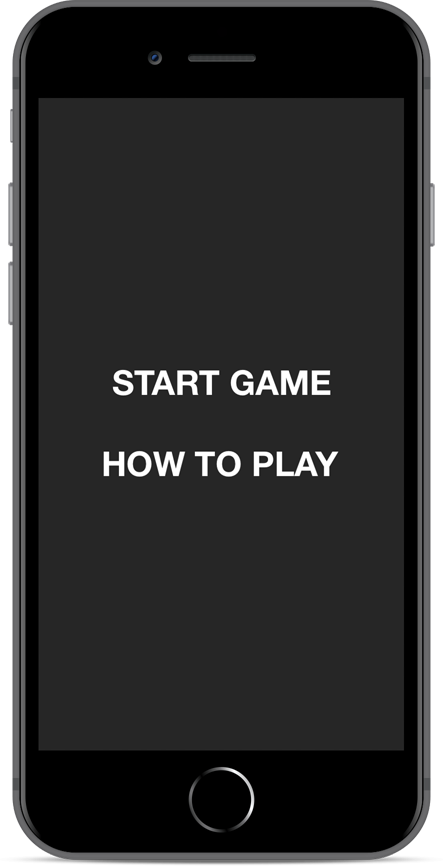
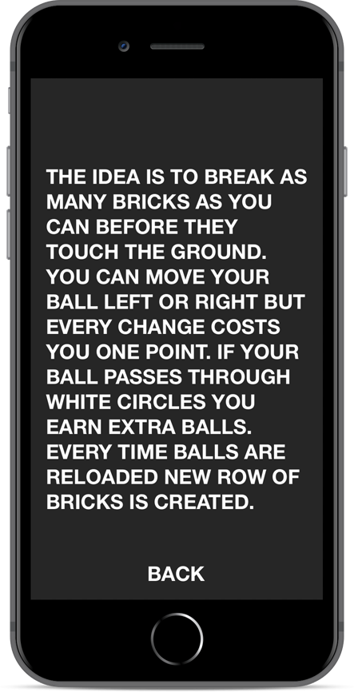
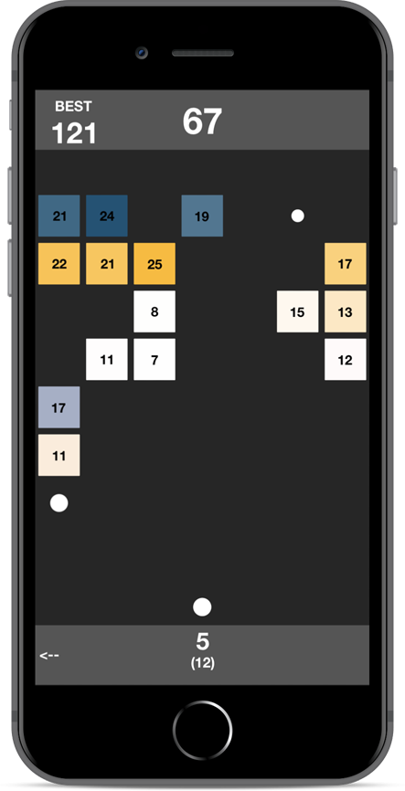
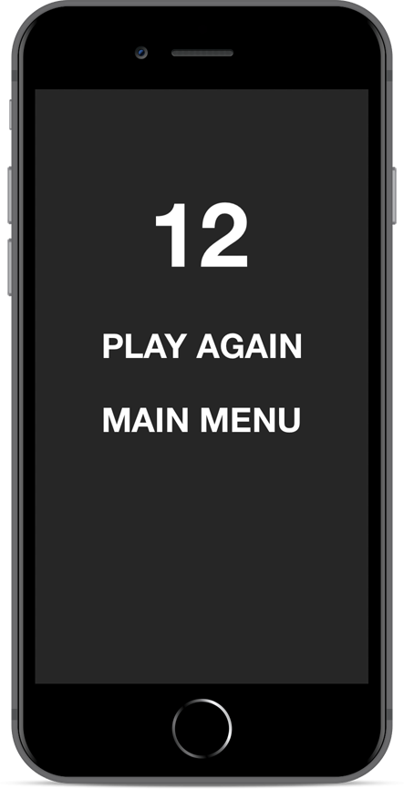

ShootThemAll
---
The idea is to break as many bricks as you can before they touch the ground. You can move your ball left or right but every change costs you one point. If your ball passes through white circles you earn extra balls. Every time balls are reloaded new row of bricks is created.

* SpriteKit
* UserDefaults

